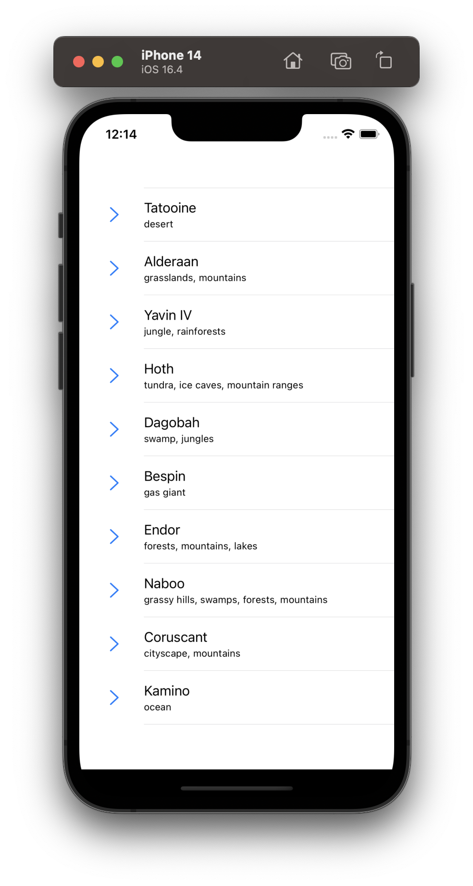
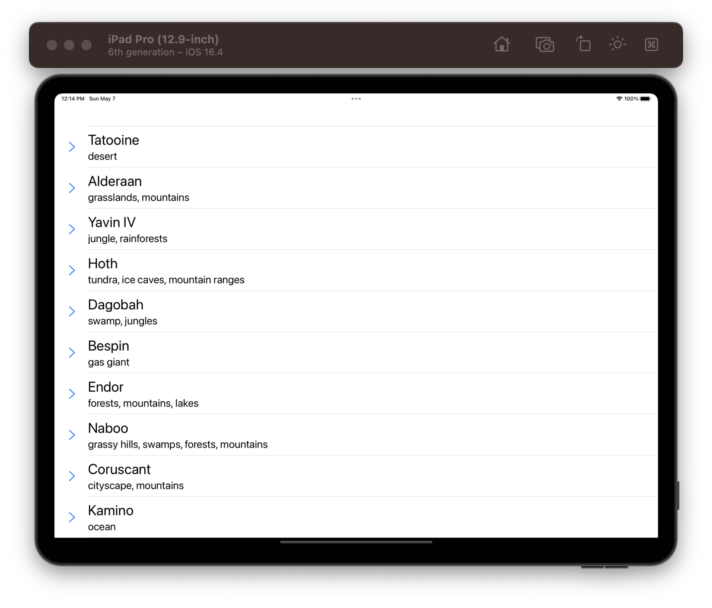
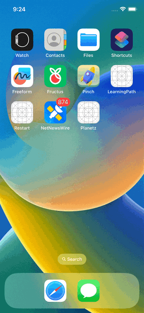

# Future features and improvements
- Autoloading more data when reach end of list.
- Add more screens like planet details, people list & details, etc.
- Pagination for showing more data.
- Loading state improvements. Eg: Skelton View
- Improve the loacal store from UserDefault to CoreData
- Splitscreen for iPad flow.

# Planetz App

<table>
<td width="25%">
</img>
</td>
<td width="50%">
</img>
</td>
<td width="20%">
</img>
</td>
</tr>
<table>

- Tech Used - Swift | UIKit | XCTestCase | Programatic AutoLayout
- The app displays list of Planets data from `https://swapi.dev/api/planets`. 
- Used persistance UserDefault to store the data for offline support.
- Architecture used is MVC. No third party libraries are used in the app.
- Used Dependency injection for decoupling, testability, reusability etc.
- Used progrmatic UI with UIKit and AutoLayout for constructing and configuring the views.
- To run unit tests, open Xcode and select `Product > Test`
- Testcoverage - 81.8%
- Basic project stucture
    
    - AppAsset
    - Main
    - Source
        - Features
            - Feature1
                - ViewModel 
                - Models
                - Views
                - Controllers
        - Networking
            - Adapters
        - Components
        - Utils
        - DataStore
        - Resources 
<details>
  <summary>Click here to check the project structure details</summary>
  
- `AppAssets` will have the files like Launchscreen xib, test plan, asset catalog, etc.
- `Main` will have the starting point of the app like AppDelegate, SceneDelegate, etc.
- `Source` will have all the other swift files
- `Source > Models` will have all the model related to this project
- `Source > Views` will have all the screens
- `Source > Controllers` will have the controllers
- `Source > Networking` will have all the network related implementation to fetch data from server.
- `Source > Networking > Adapters` will have implementations to create network request.
- `Source > Components` will have all the reusable UI components.
- `Source > Utils` will have helpers to make development easier.
- `Source > DataStore` will have implementation to supprot offline storage
- `Source > Resources` will have app constants.

</details>

# To Run The Planetz App
Clone this repo
```bash
git clone git@github.com:bibin-jaimon/Planetz.git
```

Make sure you are in `development` brach to run the app with latest changes.

Open `Planetz.xcodeproj/` and select `Planetz` scheme to run the app.

---
Contact: bibinjaimon@gmail.com
